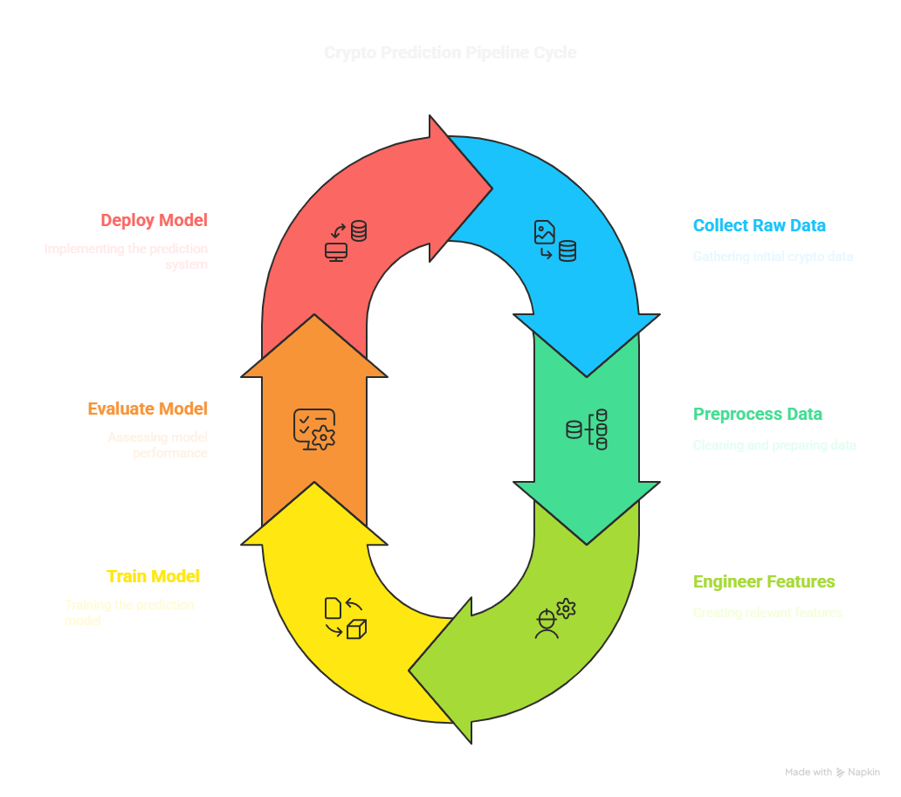

# crypto-liquidity-ml

Machine Learning project to predict cryptocurrency liquidity using FastAPI and Flask

## Overview

A comprehensive solution for predicting cryptocurrency liquidity using machine learning, implemented with FastAPI and Flask frameworks.

## 🔧 Setup and Installation

### Prerequisites

- Python 3.8+
- Git
- Virtual environment (recommended)

### Clone the repository

```bash
git clone https://github.com/RutujaUjwala/crypto-liquidity-predictor.git
cd crypto-liquidity-predictor
```

### Create virtual environment (Optional)

```bash
python -m venv venv
venv\Scripts\activate  # On Windows
source venv/bin/activate  # On Unix/macOS
```

### Install dependencies

```bash
pip install -r requirements.txt
```

## 🚀 Running the Application

### Start FastAPI App

```bash
uvicorn app.main:app --reload
# API will be available at http://127.0.0.1:8000
```

### Start Flask App

```bash
python app.py
# Web interface will be available at http://127.0.0.1:8000
```

## 🌐 Application Architecture

### Deployment Architecture


### Project Architecture



### Infrastructure


## 📝 API Documentation

Once the FastAPI server is running, visit:

- Interactive API docs (Swagger UI): [http://127.0.0.1:8000/docs](http://127.0.0.1:8000/docs)
- Alternative API docs (ReDoc): [http://127.0.0.1:8000/redoc](http://127.0.0.1:8000/redoc)
